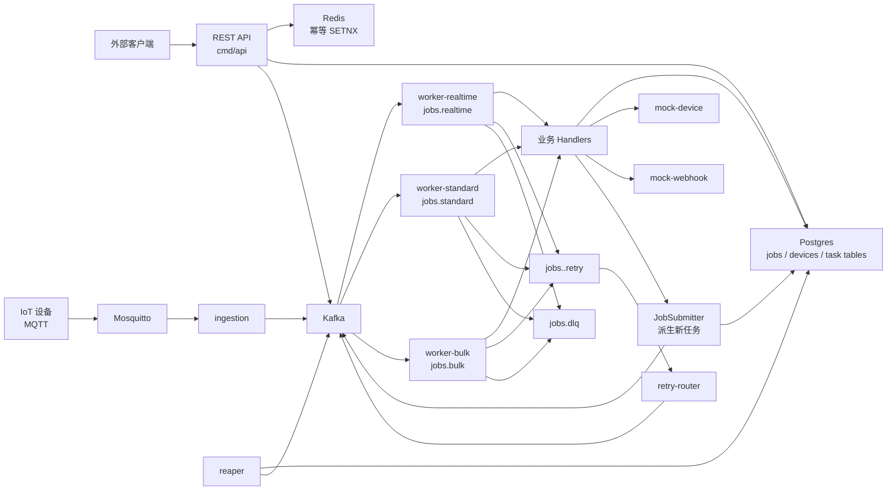
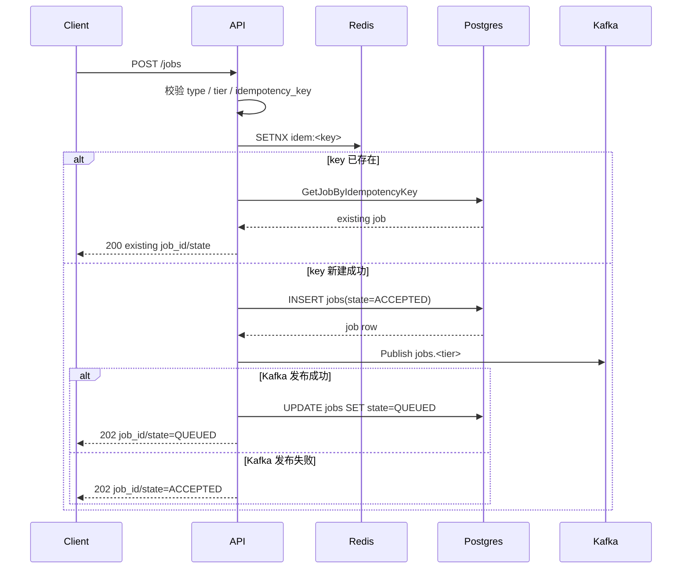
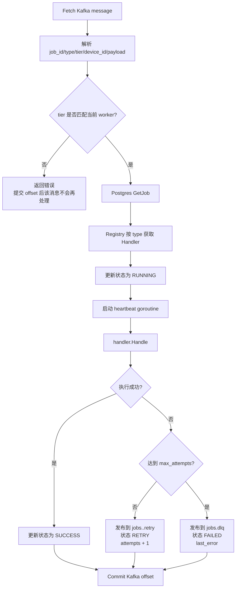
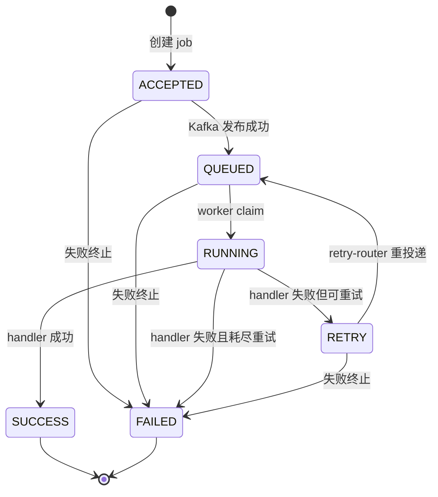
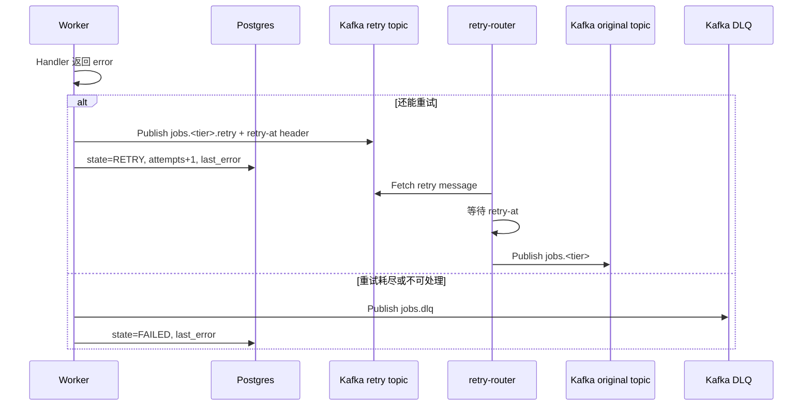
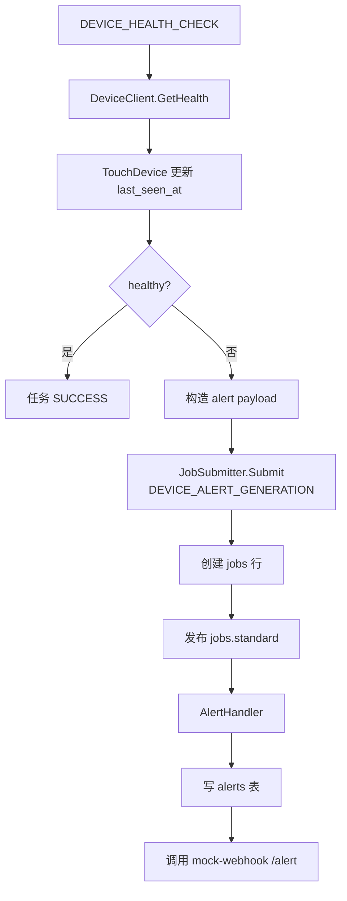
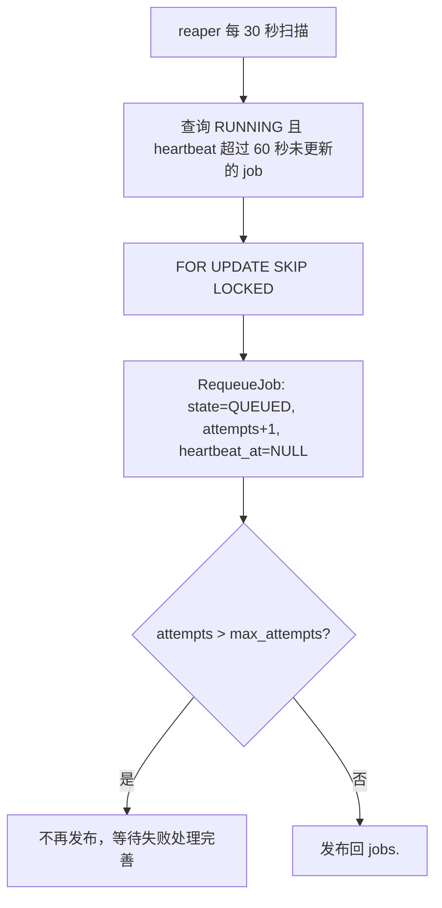

# Processing Platform 开发日志
当前进度总览
Stage 0  ✅  仓库 / Makefile / Dockerfile / lint
Stage 1  ✅  kind + Helm，PG/Redis/Kafka/MinIO/Mosquitto 起来
Stage 2  ✅  端到端单 slice（TELEMETRY_PROCESSING + worker-standard）
Stage 3  ✅  ← 你刚完成
           ├─ Phase 1: 5 种 task type + handler registry
           ├─ Phase 2: 3 个 worker tier（realtime / standard / bulk）
           ├─ Phase 3: 重试 + DLQ + retry-router
           ├─ Phase 4: heartbeat + reaper（自愈）
           ├─ Phase 5: MQTT ingestion
           └─ Phase 6: mocks + JobSubmitter + 跨 tier enqueue
Stage 4  ⏳  下一站 — Observability（Prometheus + Grafana + Loki + Tracing + Alerts）
Stage 5  □   HPA + 本地负载测试（k6 + mqtt-bench）
Stage 6  □   部署到 AWS + 云上负载测试
Stage 7  □   Admin UI + ADR + README + 截图（portfolio 收尾）
现在系统在做什么——架构与关键机制
整体数据流
┌──────────┐   HTTP/POST              ┌──────────┐  Kafka producer
│ curl/API │ ───────────────────────▶ │   api    │ ────────────────┐
│ caller   │                          └──────────┘                  │
└──────────┘                                                        │
                                                                    ▼
┌──────────┐  MQTT pub                ┌──────────┐                 ┌────────────┐
│  device  │ ──────────▶ Mosquitto ──▶│ ingestion│ ──────────────▶ │   Kafka    │
└──────────┘                          └──────────┘                 │ jobs.*     │
                                                                   │ topics     │
                                                                   └─────┬──────┘
                                                                         │ consume
                              ┌──────────────────────┬──────────────────┘
                              ▼                      ▼
                       ┌─────────────┐        ┌─────────────┐    
                       │ worker-     │  ...   │ worker-bulk │    
                       │ realtime/   │        │             │    
                       │ standard    │        │             │    
                       └──────┬──────┘        └─────────────┘    
                              │ handler.Handle
                              ▼
                  ┌──────────────────────────┐
                  │ handler registry         │
                  │ (5 个 type → 5 个 handler)│
                  └──────────┬───────────────┘
                             │
            ┌────────────────┼────────────────────┐
            ▼                ▼                    ▼
       ┌────────┐     ┌──────────┐         ┌──────────────┐
       │ Postgres│     │ mock-    │         │ JobSubmitter │
       │ (jobs,  │     │ device   │         │ (跨 job      │
       │ alerts, │     │ /webhook │         │  enqueue)    │
       │ metrics)│     └──────────┘         └──────┬───────┘
       └─────────┘                                 │ 又走一遍 Kafka
                                                   ▼
                                              jobs.<tier>
       ┌──────────┐
       │ reaper   │ ── 每 10s 扫 RUNNING + heartbeat>60s 的 job → requeue
       └──────────┘
       ┌───────────────┐
       │ retry-router  │ ── 消费 jobs.<tier>.retry，按 backoff 延迟后再投回 jobs.<tier>
       └───────────────┘                                  失败 N 次后 → jobs.dlq
关键机制和它们解决的问题
1. 三 tier 拓扑 = 不同 SLA 不互相干扰
jobs.realtime — 操作员等结果的（REMOTE_COMMAND），队列最小、扩缩最激进
jobs.standard — 默认（TELEMETRY / HEALTH_CHECK / ALERT_GEN）
jobs.bulk — 跑半小时的固件下发（FIRMWARE_UPDATE），不抢资源
internal/jobs/tier.go 的 TierFor 是单一事实源：API 和 worker 都查它，保证发送 / 消费的 tier 一致
2. 重试 + DLQ = 区分"短暂故障"和"代码 bug"
worker 处理失败 → 把消息 publish 到 jobs.<tier>.retry（带 attempts header）
retry-router 消费 .retry → sleep 指数 backoff（1s/4s/16s）→ 再 publish 回 jobs.<tier>
attempts ≥ max_attempts → 进 jobs.dlq
关键：retry 路径不阻塞 worker——worker 永远在消费主 topic，重试由独立服务异步处理
3. Heartbeat + Reaper = worker 死了也自愈
worker 处理 job 时每 10s 写 jobs.heartbeat_at = NOW()
worker 进程死了 → heartbeat 停止
reaper（独立 deployment）每 10s 扫 state=RUNNING AND heartbeat_at < NOW()-60s → 把 state 改回 QUEUED + attempts+1 + 重新 publish 到 Kafka
能恢复的关键证据：测试中看到 attempts: 0 → 1，证明 reaper 真的 requeue 了
4. Idempotency + cross-tier enqueue
API /jobs 提交时带 idempotency_key，靠 jobs.idempotency_key 唯一索引去重
handler 里如果需要触发后续 job（HealthCheck 发现 unhealthy → 发 Alert）→ 调 JobSubmitter.Submit
Submitter 走完整路径：CreateJob 拿 DB 分配的 id → publish 到 jobs.<tier> → UpdateJobState→QUEUED——和 API 一模一样的 contract
修过的坑：原版 Submitter 只 publish 不 INSERT，worker GetJob 取不到行 → 全部进 DLQ（已修，记在 technical_issues.md #6）
5. MQTT 入口 vs HTTP 入口
Mosquitto 处理设备的弱网络 / 重连 / QoS
ingestion 服务订阅 devices/+/telemetry，每条 MQTT → 一个 TELEMETRY_PROCESSING job
idempotency key = mqtt-<device>-<minute_bucket>——QoS 1 重投不会双倍下游
6. mock-device / mock-webhook = 可调失败率的"假外部世界"
mock-device：FAIL_RATE 和 LATENCY_MS 两个旋钮（env），Stage 5 chaos 测试要用
mock-webhook：alert 接收端，只 log——Alertmanager 的 SLO alert 也会路由到这里
部署形态（kind 集群里的现状）
$ kubectl get pods
api                    ✓   ← 唯一对外暴露的 HTTP 入口
worker-realtime        ✓   ── 各 1 pod，HPA 在 Stage 5 加
worker-standard        ✓
worker-bulk            ✓
retry-router           ✓
reaper                 ✓
ingestion              ✓
mock-device            ✓
mock-webhook           ✓
pp-postgresql-0        ✓   ── 数据：jobs / alerts / devices / device_metrics / health_checks
pp-redis-master-0      ✓   ── idempotency cache（API 用）
pp-kafka-controller-*  ✓×3 ── KRaft 模式，jobs.realtime / standard / bulk / .retry / .dlq
pp-minio               ✓   ── 大对象（firmware blob，Stage 5+ 才真用上）
mosquitto              ✓   ── MQTT broker


> 生成日期：2026-05-13  
> 目标：记录当前系统已经完成的组件、功能、核心流程和关键设计，帮助后续学习、维护和继续开发。

## 1. 当前完成概览

Processing Platform 是一个面向 IoT / Edge 场景的异步任务处理平台。当前代码已经具备一条比较完整的“任务提交 → Kafka 分发 → Worker 执行 → Postgres 记录状态”的主链路，并在此基础上加入了多 tier worker、重试队列、DLQ、reaper 自愈、MQTT ingestion、mock 下游服务和本地 Helm 部署。

从 git 历史和代码状态看，当前项目大致完成到：

| 阶段 | 当前状态 | 说明 |
| --- | --- | --- |
| Stage 0 | 已完成 | 项目骨架、Makefile、Dockerfile、基础 Go module。 |
| Stage 1 | 已完成 | kind 本地集群、Helm umbrella chart、Postgres / Redis / Kafka / MinIO / Mosquitto 等基础设施。 |
| Stage 2 | 已完成核心链路 | REST API 提交任务，入库，发布 Kafka，worker 消费后更新任务状态。 |
| Stage 3 | 已完成大部分 | 多任务类型、三类 worker tier、业务 handler、retry topic、DLQ、retry-router、reaper。 |
| 后续阶段 | 部分占位 | load-test、DLQ 查看命令、integration test、devsim、chaosmonkey 还未真正实现。 |

## 2. 项目结构

```text
processing_platform/
├── cmd/                         # 每个可运行服务的 main 入口
│   ├── api/                     # REST API 网关
│   ├── ingestion/               # MQTT → Kafka 的接入服务
│   ├── worker-realtime/         # realtime tier worker
│   ├── worker-standard/         # standard tier worker
│   ├── worker-bulk/             # bulk tier worker
│   ├── retry-router/            # retry topic → 原 topic 的重投递服务
│   ├── reaper/                  # 扫描卡住的 RUNNING job 并重新入队
│   ├── mock-device/             # 模拟设备控制服务
│   ├── mock-webhook/            # 模拟告警 webhook 接收端
│   ├── devsim/                  # 当前仍是占位
│   └── chaosmonkey/             # 当前仍是占位
├── internal/
│   ├── handlers/                # 不同任务类型的业务处理器
│   ├── jobs/                    # 任务类型、状态机、tier 映射、幂等 key 校验
│   ├── worker/                  # 通用 worker 消费循环和失败处理
│   ├── kafka/                   # kafka-go producer / consumer 封装
│   ├── store/                   # Postgres 访问层和 sqlc 查询
│   ├── idempotency/             # Redis SETNX 幂等控制
│   ├── jobsubmitter/            # handler 内部提交后续任务
│   ├── retry/                   # 指数退避和 jitter
│   └── mockclients/             # 调用 mock-device / mock-webhook 的 HTTP client
├── migrations/                  # 数据库迁移
├── deploy/helm/processing-platform/
│   ├── Chart.yaml               # umbrella chart
│   ├── values-local.yaml        # 本地 kind 环境配置
│   ├── templates/               # migration job 等顶层模板
│   └── charts/                  # 自定义服务 subcharts
├── scripts/                     # 本地集群 bootstrap / install 脚本
├── Makefile                     # 构建、测试、Docker、kind、调试命令
├── Dockerfile                   # 多阶段 Go build + distroless runtime
└── sqlc.yaml                    # sqlc 生成配置
```

## 3. 系统组件

### 3.1 API 服务

入口：`cmd/api/main.go`

API 是外部提交任务的 REST 网关，目前暴露：

| 接口 | 功能 |
| --- | --- |
| `GET /healthz` | 健康检查 |
| `POST /jobs` | 提交任务 |
| `GET /jobs/:id` | 查询任务详情 |

`POST /jobs` 的核心步骤：

1. 校验 JSON 请求体。
2. 校验任务类型是否属于系统已知类型。
3. 校验 `idempotency_key` 格式。
4. 通过 `jobs.TierFor` 计算任务所属 tier。
5. 使用 Redis `SETNX` 做幂等抢占。
6. 创建 Postgres `jobs` 记录，初始状态是 `ACCEPTED`。
7. 发布 Kafka 消息到 `jobs.<tier>`。
8. 发布成功后把状态更新为 `QUEUED`。
9. 返回 `202 Accepted` 和 `job_id`。

### 3.2 Postgres / Store 层

入口：

- `internal/store/store.go`
- `internal/store/queries.sql`
- `internal/store/db/*`

Store 层使用 `pgxpool` 连接 Postgres，并通过 sqlc 生成类型安全查询代码。业务层通常通过 `store.Store.Queries` 执行数据库操作。

当前核心表：

| 表 | 用途 |
| --- | --- |
| `devices` | 设备主表，包含 `id`、`last_seen_at`、`firmware_version` 等字段。 |
| `jobs` | 任务主表，记录类型、tier、状态、payload、attempts、heartbeat、错误信息等。 |
| `device_metrics` | 遥测聚合数据。 |
| `firmware_history` | 固件升级尝试历史。 |
| `command_audit` | 远程命令执行审计。 |
| `alerts` | 设备告警记录。 |

### 3.3 Redis 幂等层

入口：`internal/idempotency/idempotency.go`

API 提交任务时会把 `idempotency_key` 写入 Redis：

- Redis key 格式：`idem:<idempotency_key>`
- TTL：24 小时
- 使用 `SETNX` 保证同一个 key 只有第一个请求能继续创建任务

同时，Postgres `jobs` 表也有唯一索引：

```sql
UNIQUE (idempotency_key, type)
```

这让幂等不仅依赖 Redis，也在数据库层有最终约束。

### 3.4 Kafka 封装

入口：

- `internal/kafka/producer.go`
- `internal/kafka/consumer.go`

Producer 设计：

- 使用 `kafka.Hash{}` 按 key 分区。
- key 通常是 `device_id`，保证同一个设备的消息尽量进入同一分区，从而保序。
- `RequiredAcks = RequireAll`，提高写入可靠性。
- 同步发送，调用方能知道发布是否成功。
- LZ4 压缩，减少消息体开销。

Consumer 设计：

- 每个 worker 使用自己的 consumer group。
- 关闭自动提交，处理完成后手动 commit。
- 只有在业务结果和数据库状态已经持久化后才提交 Kafka offset。

### 3.5 Worker 三层队列

入口：

- `cmd/worker-realtime/main.go`
- `cmd/worker-standard/main.go`
- `cmd/worker-bulk/main.go`
- `internal/worker/worker.go`

系统按照任务性质拆成三个 tier：

| Tier | Topic | Worker | 适合任务 |
| --- | --- | --- | --- |
| realtime | `jobs.realtime` | `worker-realtime` | 低延迟任务，例如远程命令。 |
| standard | `jobs.standard` | `worker-standard` | 默认任务，例如遥测、健康检查、告警生成。 |
| bulk | `jobs.bulk` | `worker-bulk` | 大任务、慢任务，例如固件升级。 |

三个 worker 的 main 入口几乎一样，只差：

- 消费 topic
- consumer group id
- allowed tier

真正的消费循环在 `internal/worker/worker.go` 中复用。

### 3.6 Handler 注册表

入口：

- `internal/handlers/handlers.go`
- `internal/handlers/registry.go`

worker 不直接写具体业务逻辑，而是按任务类型从 Registry 找 Handler：

| 任务类型 | Handler | Tier | 当前功能 |
| --- | --- | --- | --- |
| `TELEMETRY_PROCESSING` | `TelemetryHandler` | standard | 写入 `device_metrics`。 |
| `REMOTE_COMMAND_EXECUTION` | `RemoteCommandHandler` | realtime | 调用 mock-device `/command`，写入 `command_audit`。 |
| `FIRMWARE_UPDATE_DISPATCH` | `FirmwareHandler` | bulk | 调用 mock-device `/firmware`，写入 `firmware_history`，成功后更新设备固件版本。 |
| `DEVICE_HEALTH_CHECK` | `HealthCheckHandler` | standard | 调用 mock-device `/health`，健康则 touch device，不健康则派生告警任务。 |
| `DEVICE_ALERT_GENERATION` | `AlertHandler` | standard | 写入 `alerts`，并调用 mock-webhook `/alert`。 |

这个设计把 worker 的通用机制和任务业务逻辑分开，新增任务时主要新增：

1. `jobs.Type`
2. `jobs.TierFor` 映射
3. 对应 Handler
4. Registry 注册
5. 必要的数据库表 / 查询

### 3.7 JobSubmitter

入口：`internal/jobsubmitter/submitter.go`

Handler 内部也可以提交新的任务，典型例子是：

```text
DEVICE_HEALTH_CHECK
  └── 如果设备不健康，派生 DEVICE_ALERT_GENERATION
```

`JobSubmitter` 复用了 API 类似的路径：

1. 根据任务类型计算 tier。
2. 创建 `jobs` 记录。
3. 发布 Kafka。
4. 更新状态为 `QUEUED`。

### 3.8 Retry Router

入口：`cmd/retry-router/main.go`

Worker 执行业务失败时，如果还没有达到最大重试次数，会把消息发布到：

```text
jobs.<tier>.retry
```

并在 Kafka header 中写入：

```text
retry-at: <unix timestamp>
```

`retry-router` 会同时 drain 三个 retry topic：

- `jobs.realtime.retry`
- `jobs.standard.retry`
- `jobs.bulk.retry`

到达 `retry-at` 后，它会把消息重新发布回原始 topic：

- `jobs.realtime`
- `jobs.standard`
- `jobs.bulk`

### 3.9 DLQ

当任务不可处理或重试耗尽时，worker 会把消息发布到：

```text
jobs.dlq
```

并把数据库中的 job 状态更新为 `FAILED`，同时写入 `last_error`。

当前 `make dlq` 还是占位命令，尚未实现真正的 DLQ 查看工具。

### 3.10 Reaper

入口：`cmd/reaper/main.go`

Reaper 用来处理一种异常情况：worker 已经把任务状态改成 `RUNNING`，但在执行过程中宕机，导致任务一直卡住。

当前策略：

- worker 执行时每 10 秒更新 `jobs.heartbeat_at`
- reaper 每 30 秒扫描一次
- 找出 `RUNNING` 且 heartbeat 超过 60 秒未更新的任务
- 使用 `FOR UPDATE SKIP LOCKED` 避免多个 reaper 抢同一行
- 把任务重新改成 `QUEUED`
- attempts + 1
- 重新发布回 `jobs.<tier>`

### 3.11 MQTT Ingestion

入口：`cmd/ingestion/main.go`

Ingestion 服务连接 Mosquitto，订阅：

```text
devices/+/telemetry
```

收到 MQTT 消息后，会构造成 `TELEMETRY_PROCESSING` 任务格式，并发布到：

```text
jobs.standard
```

注意：当前 ingestion 只发布 Kafka 消息，没有同步创建 Postgres `jobs` 行；但 worker 处理时会先 `GetJob`。因此 MQTT ingestion 路径目前是一个已搭建但还需要补齐持久化的路径。

### 3.12 Mock 服务

入口：

- `cmd/mock-device/main.go`
- `cmd/mock-webhook/main.go`
- `internal/mockclients/clients.go`

`mock-device` 提供：

| 路径 | 用途 |
| --- | --- |
| `/command` | 模拟远程命令执行 |
| `/health` | 模拟设备健康检查 |
| `/firmware` | 模拟固件推送 |
| `/healthz` | 健康检查 |

它支持环境变量：

- `FAIL_RATE`：模拟失败比例
- `LATENCY_MS`：模拟延迟

`mock-webhook` 提供：

| 路径 | 用途 |
| --- | --- |
| `/alert` | 接收告警并打印日志 |
| `/healthz` | 健康检查 |

### 3.13 本地部署与构建

入口：

- `Makefile`
- `Dockerfile`
- `scripts/bootstrap-local.sh`
- `scripts/install-infra.sh`
- `deploy/helm/processing-platform/*`

当前支持：

| 命令 | 用途 |
| --- | --- |
| `make build` | 编译所有 Go 服务到 `bin/`。 |
| `make test` | 运行单元测试。 |
| `make test-integration` | 运行 integration tag 测试，目前测试内容是 skip 占位。 |
| `make up` | 创建 kind 集群并安装 Helm chart。 |
| `make down` | 删除 kind 集群。 |
| `make seed` | 插入示例设备 `device-001`。 |
| `make port-forward-api` | 把 API service 转发到本地 `8080`。 |
| `make submit-job` | 提交一个示例 telemetry job。 |
| `make get-job ID=<uuid>` | 查询任务。 |
| `make docker-build-*` | 构建对应服务镜像。 |

Dockerfile 使用多阶段构建：

1. `golang:1.25-alpine` 编译指定 `cmd/<binary>`。
2. `distroless/static-debian12:nonroot` 运行静态二进制。

Helm umbrella chart 包含：

- Bitnami PostgreSQL
- Bitnami Redis
- Bitnami Kafka
- Bitnami MinIO
- 自定义 Mosquitto
- API
- 三个 worker
- retry-router
- reaper
- ingestion
- mock-device
- mock-webhook
- migration job

## 4. 核心流程图

### 4.1 系统总览



### 4.2 REST 提交流程



### 4.3 Worker 执行流程



### 4.4 任务状态机



### 4.5 Retry / DLQ 流程



### 4.6 健康检查派生告警任务



### 4.7 Reaper 自愈流程



## 5. 关键设计

### 5.1 异步优先

系统没有在 API 请求里直接执行设备控制、固件升级或数据处理，而是统一把工作转成 job，再交给 Kafka 和 worker。这样可以：

- 降低 API 请求延迟。
- 把慢任务从请求链路中拿出去。
- 通过 Kafka 缓冲流量峰值。
- 允许 worker 横向扩容。

### 5.2 Postgres 是状态事实源，Kafka 是投递通道

Kafka 负责消息分发，但任务状态以 Postgres `jobs` 表为准。worker 每次处理消息时都会先根据 `job_id` 查数据库，再推进状态。

这个设计让任务可以被查询、审计和恢复，也让 reaper 能够发现卡住的任务。

### 5.3 多 tier 隔离

任务被拆分到 realtime / standard / bulk 三类 topic 和 worker：

- 实时任务不被大批量慢任务堵住。
- bulk 任务可以单独设置更低优先级和更长处理时间。
- 标准任务承担默认业务流。

`jobs.TierFor` 是任务类型到 tier 的唯一映射来源，API 和 worker 都依赖它。

### 5.4 Handler Registry 解耦

worker 主循环只负责：

- 消费 Kafka
- 校验 tier
- 读取 job
- 推进状态
- 调用 handler
- 处理 retry / DLQ
- commit offset

具体业务逻辑都在 handler 中。这样新增业务类型时，不需要复制 worker 循环。

### 5.5 手动提交 Kafka offset

Consumer 设置 `CommitInterval: 0`，不会自动提交。worker 在处理结束后才 commit。

这意味着：

- 如果 worker 处理过程中崩溃，消息不会被错误确认。
- 如果数据库状态已经写入，再 commit，可以减少“消息已提交但状态没落库”的风险。

### 5.6 Retry 与延迟等待分离

worker 失败时不会自己 sleep 等重试，而是把消息发到 retry topic，由 retry-router 统一等待 `retry-at` 再重投递。

这样避免 worker 持有 Kafka partition 长时间阻塞，也让重试策略集中在一个服务里。

### 5.7 Heartbeat + Reaper 自愈

worker 进入 `RUNNING` 后定期写 heartbeat。reaper 扫描过期 heartbeat，把卡住任务重新入队。

这个设计解决的是“worker 死在执行中间”的问题，属于异步任务系统里很重要的一种恢复机制。

### 5.8 下游依赖通过接口注入

Handler 不直接依赖具体 HTTP 实现，而是依赖接口：

- `DeviceClient`
- `WebhookClient`
- `JobSubmitter`

这让测试和替换真实下游服务更容易。

### 5.9 本地基础设施接近真实部署

项目使用 kind + Helm + Docker 镜像运行，而不是只用本地进程拼接。这样虽然复杂一些，但可以更早验证：

- Kubernetes deployment
- service discovery
- Helm values
- migration hook
- readiness / liveness probe
- Kafka / Redis / Postgres 连接配置

## 6. 当前功能清单

### 已实现

- REST 提交任务。
- REST 查询任务。
- Redis 幂等 key 抢占。
- Postgres job 状态记录。
- Kafka producer / consumer 封装。
- realtime / standard / bulk 三层 worker。
- 任务类型到 tier 的映射。
- worker 通用消费循环。
- handler registry。
- 遥测写入 `device_metrics`。
- 远程命令审计写入 `command_audit`。
- 固件升级历史写入 `firmware_history`。
- 健康检查派生告警任务。
- 告警写入 `alerts` 并调用 webhook。
- 指数退避 + jitter。
- retry topic。
- retry-router。
- DLQ 发布。
- heartbeat。
- reaper 重入队。
- mock-device 和 mock-webhook。
- kind + Helm 本地部署脚本。
- Docker 多阶段构建。
- 基础单元测试。

### 已搭建但待完善

- MQTT ingestion 路径已能消费 MQTT 并发布 Kafka，但还没有创建 Postgres job 行。
- integration tests 当前是 skip 占位。
- `make dlq` 当前只是占位输出。
- `make load-test` 当前只是占位输出。
- `cmd/devsim` 当前只是 stage 0 stub。
- `cmd/chaosmonkey` 当前只是 stage 0 stub。
- API 在 Kafka publish 失败时会留下 `ACCEPTED` job，但当前 reaper 只处理 `RUNNING` stale job；`ACCEPTED` 重发布恢复还没补齐。

## 7. 学习路线建议

建议按下面顺序读代码：

1. 先看 `internal/jobs/types.go`、`internal/jobs/tier.go`、`internal/jobs/state.go`，理解任务类型、tier 和状态机。
2. 再看 `cmd/api/main.go`，理解任务如何从 REST 请求进入系统。
3. 看 `internal/store/queries.sql` 和 `migrations/*.sql`，对应数据库表和状态更新。
4. 看 `internal/kafka/producer.go`、`internal/kafka/consumer.go`，理解消息投递和手动 commit。
5. 看 `internal/worker/worker.go`，这是整个异步执行链路的核心。
6. 看 `internal/handlers/*`，理解每种任务做什么。
7. 看 `internal/jobsubmitter/submitter.go`，理解任务如何派生新任务。
8. 看 `cmd/retry-router/main.go` 和 `internal/retry/backoff.go`，理解失败重试。
9. 看 `cmd/reaper/main.go`，理解 worker 崩溃后的自愈。
10. 最后看 `deploy/helm/processing-platform` 和 `Makefile`，理解服务如何部署起来。

## 8. 一次典型任务的完整故事

以 `TELEMETRY_PROCESSING` 为例：

1. 用户先通过 `make seed` 插入 `device-001`。
2. 客户端请求 `POST /jobs`，提交类型为 `TELEMETRY_PROCESSING` 的任务。
3. API 判断它属于 `standard` tier。
4. API 使用 Redis 抢占幂等 key。
5. API 写入 `jobs` 表，状态为 `ACCEPTED`。
6. API 发布 Kafka 消息到 `jobs.standard`。
7. API 把 job 状态更新成 `QUEUED`。
8. `worker-standard` 消费 `jobs.standard`。
9. worker 从 Postgres 读取 job。
10. worker 找到 `TelemetryHandler`。
11. worker 把 job 状态改成 `RUNNING`。
12. handler 解析 payload，把数据写入 `device_metrics`。
13. 成功后 worker 把 job 状态改成 `SUCCESS`。
14. worker commit Kafka offset。
15. 用户通过 `GET /jobs/:id` 可以看到最终状态。

如果 handler 失败：

- 第一次失败：进入 `jobs.standard.retry`，状态为 `RETRY`，attempts + 1。
- retry-router 等待 `retry-at` 后重新发布回 `jobs.standard`。
- 多次失败并耗尽 `max_attempts` 后：进入 `jobs.dlq`，状态为 `FAILED`。

## 9. 后续开发重点

如果继续推进这个项目，优先级较高的工作可能是：

1. 修复 / 完善 MQTT ingestion：确保 MQTT 创建的 job 也写入 Postgres。
2. 实现 integration test：覆盖 API → Kafka → worker → Postgres 的真实生命周期。
3. 实现 DLQ 查看命令：让 `make dlq` 能读取 `jobs.dlq` 或展示失败任务。
4. 实现 devsim：批量模拟设备遥测、健康检查和远程命令。
5. 实现 chaosmonkey：主动制造 worker / 下游服务失败，用来验证 retry、DLQ、reaper。
6. 补齐 `ACCEPTED` 状态任务的恢复机制：处理 API 入库成功但 Kafka 发布失败的情况。
7. 增加可观测性：结构化日志字段、Prometheus metrics、dashboard、告警。

## 10. 快速命令备忘

```bash
# 运行单元测试
make test

# 编译所有服务
make build

# 启动本地 kind + Helm 环境
make up

# 插入一个示例设备
make seed

# 转发 API 到本地
make port-forward-api

# 提交示例 job
make submit-job

# 查询 job
make get-job ID=<job_id>

# 删除本地 kind 集群
make down
```

## 11. 总结

当前系统已经从“单个 REST 服务”发展成一个具备真实分布式任务平台形态的项目：有持久化任务状态、有 Kafka 异步队列、有多层 worker、有失败重试、有 DLQ、有 reaper 自愈，也有本地 Kubernetes 部署。

最值得抓住的主线是：

```text
API / Ingestion 是入口
Kafka 是任务分发通道
Postgres 是任务状态事实源
Worker 是执行者
Handler 是业务逻辑
Retry Router 和 Reaper 是可靠性补偿机制
Helm / kind 是运行环境
```

理解这条主线后，读每个文件都会更轻松：它们大多是在服务这条链路中的某一个清晰位置。
