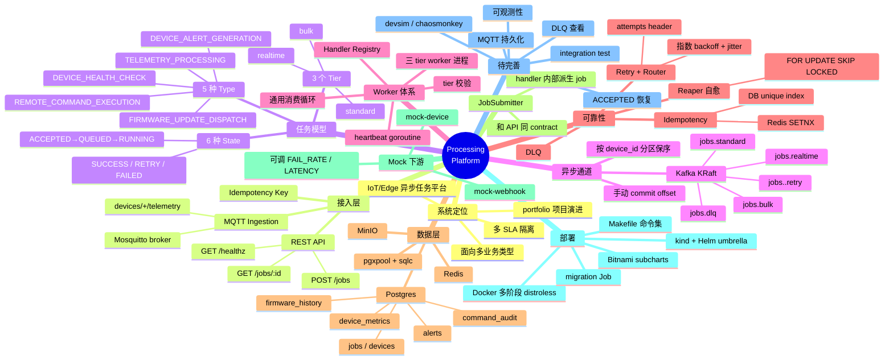

# Processing Platform 系统脑图

> 生成日期：2026-05-13
> 用途：把当前代码里所有重要的方向、功能、设计点和技术细节做成一张层级清晰的脑图，便于回顾、面试讲解和后续开发。

---

## 0. 一图看全（Mermaid Mindmap）

---

## 1. 系统定位与整体定位

- **业务场景**：面向 IoT / Edge 的异步任务处理平台，把"设备遥测、远程命令、固件下发、健康检查、告警"等慢/异步操作统一为 Job。
- **设计目标**
  - 把所有重业务搬出 HTTP 请求链路，API 只负责接单。
  - 不同 SLA 任务互不抢占资源（多 tier 隔离）。
  - 任务可观察、可审计、可重试、可自愈。
  - 本地用 kind + Helm 跑得起来，部署形态尽量贴近真实云上 K8s。
- **演进阶段**（开发日志）
  - Stage 0 ~ 3 已完成：仓库脚手架、Helm 基础设施、端到端单 slice、5 种 task type + 3 tier + retry/DLQ/reaper + MQTT ingestion + mocks。
  - Stage 4 进行中：Observability（Prometheus/Grafana/Loki/Tracing/Alerts）。
  - Stage 5 ~ 7 待办：HPA + 负载测试、AWS 部署、Admin UI + portfolio 收尾。

---

## 2. 整体架构与数据流

- **三条入口路径**
  - 外部 HTTP 调用 → API → Kafka。
  - 设备 MQTT → Mosquitto → Ingestion → Kafka。
  - Handler 派生 → JobSubmitter → Kafka（内部入口）。
- **核心管道**：Kafka `jobs.<tier>` topic 把任务分发给对应 tier 的 worker。
- **持久层**：Postgres 是任务状态事实源；Redis 是幂等抢占；MinIO 留给固件大对象（Stage 5+）。
- **可靠性补偿**
  - retry-router：异步处理 retry topic，避免 worker 长时间持有 partition。
  - reaper：心跳超时的 RUNNING 任务自动重新入队。
- **下游模拟**：mock-device 和 mock-webhook 替代真实设备和告警接收端，用于本地链路打通和 chaos 测试。

---

## 3. 接入层（Ingress）

### 3.1 REST API（`cmd/api/main.go`）

- 路由
  - `GET /healthz` — liveness/readiness。
  - `POST /jobs` — 主入口，提交任务。
  - `GET /jobs/:id` — 查询任务详情。
- `POST /jobs` 关键步骤
  - JSON 校验 → type 校验 → idempotency_key 格式校验。
  - `jobs.TierFor(type)` 计算 tier，写入 job 行。
  - Redis `SETNX idem:<key>` 抢占（TTL 24h）。
  - Postgres `INSERT jobs` 状态 `ACCEPTED`。
  - Kafka publish 到 `jobs.<tier>`。
  - 发布成功后 update 为 `QUEUED`，返回 `202 Accepted`。
- 失败语义
  - SETNX 已存在 → 查 DB 返回原 job，保证幂等。
  - Kafka 发布失败 → 状态停留在 `ACCEPTED`，TODO：补一个 ACCEPTED reaper。

### 3.2 MQTT Ingestion（`cmd/ingestion/main.go`）

- 订阅 `devices/+/telemetry`（QoS 1）。
- 每条消息构造一个 `TELEMETRY_PROCESSING` job payload。
- 计算 idempotency key = `mqtt-<device>-<minute_bucket>`，防止 QoS 重投放大下游。
- 直接 publish 到 `jobs.standard`。
- **已知缺陷**：当前未同步 `INSERT jobs` 行，worker 端 `GetJob` 会失败，需要补齐持久化路径。

---

## 4. 任务模型（Job Model）

### 4.1 Type（5 种业务类型）

- `TELEMETRY_PROCESSING` — 遥测数据归档。
- `REMOTE_COMMAND_EXECUTION` — 操作员等结果的远程控制。
- `FIRMWARE_UPDATE_DISPATCH` — 大对象固件下发。
- `DEVICE_HEALTH_CHECK` — 周期性健康检查。
- `DEVICE_ALERT_GENERATION` — 告警生成。

### 4.2 Tier 映射（`internal/jobs/tier.go`）

- `TierFor()` 是**单一事实源**，API 和 worker 都查它。
- `realtime` — REMOTE_COMMAND_EXECUTION。
- `standard` — TELEMETRY / HEALTH_CHECK / ALERT_GENERATION（默认）。
- `bulk` — FIRMWARE_UPDATE_DISPATCH（慢、大）。
- worker 启动时声明自己的 allowed tier，消费时校验 tier 是否匹配。

### 4.3 State Machine（6 状态）

- 状态转移
  - `[*] → ACCEPTED`：API 入库成功。
  - `ACCEPTED → QUEUED`：Kafka 发布成功。
  - `QUEUED → RUNNING`：worker claim。
  - `RUNNING → SUCCESS`：handler 成功。
  - `RUNNING → RETRY`：handler 可重试失败。
  - `RUNNING / RETRY → FAILED`：耗尽重试或不可恢复。
  - `RETRY → QUEUED`：retry-router 重投。
- 终态：`SUCCESS` / `FAILED`。

### 4.4 Job 数据字段

- 必有：`id` / `type` / `tier` / `state` / `payload`。
- 重试与自愈：`attempts` / `max_attempts` / `heartbeat_at` / `last_error`。
- 关联：`device_id` / `idempotency_key`。

---

## 5. 异步通道（Kafka 层）

### 5.1 Topic 拓扑

- 主流：`jobs.realtime` / `jobs.standard` / `jobs.bulk`。
- 重试：`jobs.realtime.retry` / `jobs.standard.retry` / `jobs.bulk.retry`。
- 死信：`jobs.dlq`（全 tier 共用）。

### 5.2 Producer 设计（`internal/kafka/producer.go`）

- `kafka.Hash{}` balancer + `device_id` 作为 key → 同一设备消息顺序。
- `RequiredAcks = RequireAll` → 多副本确认。
- 同步发送 → 调用方知道是否成功。
- LZ4 压缩 → 减小消息体。
- 还有 `instrumented_producer.go` 包装一层 metrics/trace（observability 衔接位）。

### 5.3 Consumer 设计（`internal/kafka/consumer.go`）

- 每个 worker 独立的 consumer group。
- `CommitInterval: 0` → 关闭自动提交。
- 业务完成 + DB 落库后才手动 commit。
- 配合 trace carrier（`trace_carrier.go`）：在 Kafka header 里传 W3C traceparent。

### 5.4 Kafka 部署

- `pp-kafka-controller-*` × 3，KRaft 模式（无 Zookeeper）。
- 通过 Bitnami subchart 集成进 Helm umbrella。

---

## 6. Worker 与 Handler 体系

### 6.1 三 tier worker 进程

- `cmd/worker-realtime` / `worker-standard` / `worker-bulk` 三个独立 deployment。
- main 入口几乎一样，只差 topic / group id / allowed tier。
- 真正逻辑在 `internal/worker/worker.go`。

### 6.2 通用消费循环

- Fetch Kafka 消息 → 解析 job_id / type / tier / device_id / payload。
- 校验 tier 是否匹配当前 worker（不匹配直接返回错误，提交 offset 跳过）。
- Postgres `GetJob` 读取最新状态。
- Registry `LookupHandler(type)` 找业务 handler。
- 更新状态为 `RUNNING` 并启动 heartbeat goroutine。
- 调 `handler.Handle(ctx, job)`。
- 根据返回值分支：成功 → SUCCESS / 可重试 → retry topic / 耗尽 → DLQ。
- 最后才 commit Kafka offset。

### 6.3 Handler Registry（`internal/handlers/registry.go`）

| 类型 | Handler | Tier | 主要动作 |
| --- | --- | --- | --- |
| TELEMETRY_PROCESSING | TelemetryHandler | standard | 写 `device_metrics` |
| REMOTE_COMMAND_EXECUTION | RemoteCommandHandler | realtime | 调 mock-device `/command` + 写 `command_audit` |
| FIRMWARE_UPDATE_DISPATCH | FirmwareHandler | bulk | 调 mock-device `/firmware` + 写 `firmware_history` + 更新设备固件版本 |
| DEVICE_HEALTH_CHECK | HealthCheckHandler | standard | 调 mock-device `/health` + touch device，不健康则派生 alert job |
| DEVICE_ALERT_GENERATION | AlertHandler | standard | 写 `alerts` + 调 mock-webhook `/alert` |

### 6.4 新增任务类型的标准动作

- 加 `jobs.Type` 常量。
- 在 `TierFor` 增加映射。
- 实现 Handler（依赖通过接口注入）。
- Registry 注册。
- 补必要的数据库表 / sqlc 查询。

---

## 7. 可靠性与自愈机制

### 7.1 Retry 流水线

- worker 失败时把消息 publish 到 `jobs.<tier>.retry`，写入 `retry-at` header。
- retry-router 同时 drain 三个 retry topic，sleep 到 `retry-at` 再 publish 回主 topic。
- backoff 由 `internal/retry/backoff.go` 计算：指数 1s/4s/16s + jitter。
- worker 永远只消费主 topic，不阻塞。

### 7.2 DLQ

- `attempts >= max_attempts` 或不可处理 → publish 到 `jobs.dlq`。
- DB 状态变 `FAILED`，写 `last_error`。
- `make dlq` 暂时是占位，待补 DLQ 浏览工具。

### 7.3 Heartbeat + Reaper

- worker 在 RUNNING 期间每 10s 写 `jobs.heartbeat_at = NOW()`。
- reaper 每 30s 扫一次：`state = RUNNING AND heartbeat_at < NOW() - 60s`。
- `FOR UPDATE SKIP LOCKED` 防多 reaper 抢同一行。
- 命中后 `RequeueJob`：状态改回 QUEUED、`attempts + 1`、`heartbeat_at = NULL`、re-publish 到 `jobs.<tier>`。
- 实际跑通的证据：attempts 0 → 1 的真实观测。

### 7.4 Idempotency

- 双重保险：Redis SETNX（运行时去重） + Postgres `UNIQUE (idempotency_key, type)`（持久去重）。
- MQTT 路径用 `mqtt-<device>-<minute_bucket>` 作为 key，对 QoS 重投天然友好。

### 7.5 手动 offset commit

- 处理结束才 commit，崩溃中途消息不会被错认。
- 配合 DB 落库的先后顺序，降低"消息已确认但状态没落库"的风险。

### 7.6 关键 bug 修复点

- 原 JobSubmitter 只 publish 不 INSERT → 派生任务在 worker 端 GetJob 失败被全量送进 DLQ。
- 修复后 Submitter 走和 API 一样的 contract（CreateJob → publish → UpdateJobState=QUEUED）。
- 在 technical_issues.md #6 留底。

---

## 8. 数据存储层

### 8.1 Postgres（事实源）

- `pgxpool` 连接 + sqlc 类型安全查询。
- 核心表
  - `devices` — 设备主表（last_seen_at、firmware_version 等）。
  - `jobs` — 任务主表。
  - `device_metrics` — 遥测聚合。
  - `firmware_history` — 固件升级历史。
  - `command_audit` — 远程命令审计。
  - `alerts` — 设备告警。
- migrations 同时存在 `migrations/` 和 `deploy/helm/.../files/migrations/` 两份（Helm chart 引用后者作为 Job）。

### 8.2 Redis

- 用途：API 提交时的幂等抢占 + 未来缓存位。
- key：`idem:<idempotency_key>`，TTL 24h。

### 8.3 MinIO

- 现状：起来了但还没真正用上，Stage 5+ 固件 blob 存储。

---

## 9. 跨任务派生（JobSubmitter）

- 入口：`internal/jobsubmitter/submitter.go`。
- 调用者：handler（典型例子 HealthCheck 发现不健康 → 派生 Alert）。
- 流程：`TierFor` → `CreateJob` → publish 到 `jobs.<tier>` → update 状态 `QUEUED`。
- 关键点：和 API 完全一样的契约，避免出现"半个任务"状态。

---

## 10. Mock 下游服务

### 10.1 mock-device

- 路径：`/command` / `/health` / `/firmware` / `/healthz`。
- 环境变量旋钮
  - `FAIL_RATE` — 失败比例。
  - `LATENCY_MS` — 延迟。
- 用途：chaos / 重试 / DLQ / reaper 这些机制的可控测试源。

### 10.2 mock-webhook

- 路径：`/alert` / `/healthz`。
- 只记录日志，Alertmanager 的 SLO alert 也可以路由到这里（Stage 4）。

### 10.3 mockclients

- `internal/mockclients/clients.go` 提供 `DeviceClient` / `WebhookClient` 接口实现。
- handler 全部依赖接口 → 测试时可注入 fake。

---

## 11. 部署与基础设施

### 11.1 本地形态（kind + Helm）

- Helm umbrella chart：`deploy/helm/processing-platform`。
- Subcharts
  - Bitnami：postgresql / redis / kafka / minio。
  - 自定义：mosquitto / api / worker-realtime / worker-standard / worker-bulk / retry-router / reaper / ingestion / mock-device / mock-webhook。
- 顶层 templates
  - `migration-job.yaml`（Helm hook 拉起 DB migration）。
  - `servicemonitors.yaml`（Prometheus Operator 衔接）。
  - `grafana-datasources.yaml`。

### 11.2 镜像与构建

- Dockerfile 多阶段
  - Builder：`golang:1.25-alpine` build 指定 `cmd/<binary>`。
  - Runtime：`distroless/static-debian12:nonroot` 静态二进制 + 非 root。
- 每个服务一个镜像（`make docker-build-*`）。

### 11.3 Makefile 命令集

- 构建测试：`make build` / `make test` / `make test-integration`。
- 集群生命周期：`make up` / `make down`。
- 数据初始化：`make seed`（device-001）。
- 调试：`make port-forward-api` / `make submit-job` / `make get-job ID=<uuid>`。
- 占位待实现：`make dlq` / `make load-test`。

### 11.4 Pod 现状

- 单 pod 服务：api / retry-router / reaper / ingestion / mock-device / mock-webhook。
- 三 tier worker：worker-realtime / worker-standard / worker-bulk（HPA 在 Stage 5 加）。
- 有状态/基础设施：pp-postgresql-0 / pp-redis-master-0 / pp-kafka-controller × 3 / pp-minio / mosquitto。

---

## 12. 可观测性（Stage 4，进行中）

- 已存在脚手架
  - `internal/observability/observability.go` — 初始化逻辑。
  - `internal/observability/metrics.go` — Prometheus 指标。
  - `internal/observability/gin_middleware.go` — API 请求埋点。
  - `internal/kafka/instrumented_producer.go` — Kafka 端 metrics/trace 包装。
  - `internal/kafka/trace_carrier.go` — Kafka header 上的 W3C trace 传递。
- Helm 侧已经预留 ServiceMonitor 和 Grafana datasource。
- 计划补齐：结构化日志字段、Prometheus exporter、Grafana 看板、Loki、Tracing（OTel）、Alertmanager → mock-webhook。

---

## 13. 关键设计哲学

- **异步优先**：API 不做重活，统统转 Job + Kafka，方便横向扩 worker、平滑流量峰。
- **Postgres 是事实源，Kafka 是通道**：状态以 DB 为准，Kafka 只负责派发，方便审计和恢复。
- **多 tier 隔离**：realtime 不被 bulk 堵；TierFor 单点真源。
- **Handler Registry 解耦**：worker 主循环复用，业务逻辑插件化。
- **Retry / 等待分离**：worker 不 sleep，retry-router 集中调度延迟。
- **手动 offset commit**：避免确认了但没落库的不一致。
- **Heartbeat + Reaper**：覆盖 worker 中途崩溃这一类异常。
- **下游通过接口注入**：handler 不绑死 HTTP 实现，易测易换。
- **本地部署贴近生产**：kind + Helm，提前暴露 K8s/Helm/Probe/Migration 这些坑。

---

## 14. 当前能力清单

### 14.1 已实现

- REST 提交 / 查询任务。
- Redis 幂等抢占 + DB 唯一约束。
- Kafka producer/consumer 封装（分区保序、LZ4、同步、ack=all）。
- 三 tier worker + 通用消费循环。
- TierFor 单点映射。
- 5 个 Handler（telemetry / command / firmware / health / alert）。
- 指数 backoff + jitter，retry topic + retry-router。
- DLQ publish。
- heartbeat + reaper（含 SKIP LOCKED）。
- MQTT ingestion 主链路（除 DB 持久化外都跑通）。
- JobSubmitter 派生任务（HealthCheck → Alert）。
- mock-device / mock-webhook + 可调失败率。
- kind + Helm 本地部署一键起。
- Docker 多阶段 distroless。
- 基础单元测试。

### 14.2 已搭建但待完善

- MQTT ingestion 还没同步写 `jobs` 行。
- integration test 是 skip 占位。
- `make dlq` / `make load-test` 是占位。
- `cmd/devsim` / `cmd/chaosmonkey` 是 stub。
- API Kafka 发布失败时 `ACCEPTED` 状态没有 reaper 兜底。
- 完整 Observability（metrics/log/trace/dashboard/alert）还在搭。

---

## 15. 一句话主线总结

> **API / Ingestion 接单 → Kafka 派发 → Worker 拉取 → Handler 执行 → Postgres 落账 → Retry/DLQ/Reaper 补偿 → Helm/kind 把这一切跑在 K8s 上。**

理解了这条主线，每个文件大致都能定位到"它在哪一段链路上为哪一种保障服务"。
